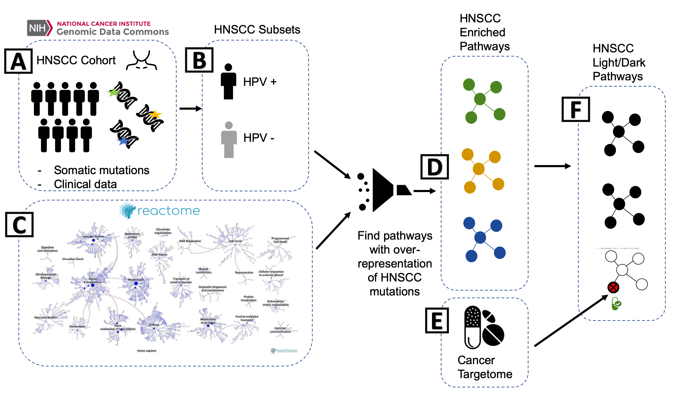

# HNSCC_Notebook

<!-- badges: start -->

<!-- badges: end -->

This repository contains the workflow for light and dark pathway analysis of head and neck squamous cell carcinoma (HNSCC). For the TCGA cohort, we first assessed biological pathways that are significantly enriched for gene mutations in HNSCC patient tumors and then evaluated whether these pathways contained drug targets of FDA-approved cancer drugs. Enriched pathways containing drug targets are "light" to drugs and therefore of interest for targeting with the current set of approved drugs. Enriched pathways containing no drug targets are "dark" to drugs and of interest for future therapeutics development. 

### Notebook
The notebook for this analysis can be found [here](https://github.com/biodev/HNSCC_Notebook/blob/master/HNSCC_Dark_Pathways.ipynb). This workflow requires the input files outlined below and produces the "light" and "dark" pathways presented and discussed in our manuscript.

### Input 
[TCGA HNSCC cohort mutation data.](https://github.com/biodev/HNSCC_Notebook/blob/master/data/TCGA.HNSC.mutect.84c7a87a-9dcc-48fb-bd69-ba9d6e6f3ca2.DR-7.0.somatic_cleaned.maf) Gene mutations for the TCGA head and neck squamous cell carcinoma cohort.

[TCGA HNSCC cohort copy number data](https://github.com/biodev/HNSCC_Notebook/blob/master/data/gistic_long_file.maf) Copy number alterations for the TCGA head and neck squamous cell carcinoma cohort.

[Reactome Pathway Gene List.](https://github.com/biodev/HNSCC_Notebook/tree/master/reference_data/paths) Reactome pathways and gene members used in the pathway analysis. 

[Target list for FDA-approved cancer drugs.](https://github.com/biodev/HNSCC_Notebook/blob/master/data/Targetome_Level123_8_7_17.txt) Abbreviated file containing drug targets for FDA-approved cancer drugs aggregated in the Cancer Targetome. The full drug-target interaction file with supportive evidence (used to create Figure 4) can also be found [here](https://github.com/biodev/HNSCC_Notebook/blob/master/data/Targetome_FullEvidence_070617.txt).

[HPV consensus annotation file.](https://github.com/biodev/HNSCC_Notebook/blob/master/data/HPV_Annotation_MB.csv) Consensus annotation file for HPV tumor status created by our group across three sources of HPV annotation. Details in accompanying [readme](https://github.com/biodev/HNSCC_Notebook/blob/master/data/HPV_Annotation_MB_README.txt).

### Output

[Mutation Enriched Light Pathways](https://github.com/biodev/HNSCC_Notebook/blob/master/output/study_hnscc/results/overlap_analysis/Aberrationally%20enriched%2C%20containing%20drug%20targets.txt) are pathways found to be mutationally enriched in the cohort and also drug-targeted.

[Mutation Enriched Dark Pathways](https://github.com/biodev/HNSCC_Notebook/blob/master/output/study_hnscc/results/overlap_analysis/Aberration%20enriched%2C%20not%20drug%20targeted.txt) are pathways found to be mutationall enriched in the cohort and are not currently drug-targeted.

[Copy Number Enriched Light Pathways](https://github.com/biodev/HNSCC_Notebook/blob/master/output/study_hnscc_cnv_only/results/overlap_analysis/Aberrationally%20enriched%2C%20containing%20drug%20targets.txt) are pathways found to be copy number enriched in the cohort and also drug-targeted.

[Copy Number Enriched Dark Pathways](https://github.com/biodev/HNSCC_Notebook/blob/master/output/study_hnscc_cnv_only/results/overlap_analysis/Aberration%20enriched%2C%20not%20drug%20targeted.txt) are pathways found to be copy number enriched in the cohort and are not currently drug-targeted.

Additional output for the sub-analysis of HPV cohorts: 

[HPV-Positive Cohort Light Pathways](https://github.com/biodev/HNSCC_Notebook/blob/master/output/study_hnscc_hpv_positive/results/overlap_analysis/Aberrationally%20enriched%2C%20containing%20drug%20targets.txt)

[HPV-Positive Cohort Dark Pathways](https://github.com/biodev/HNSCC_Notebook/blob/master/output/study_hnscc_hpv_positive/results/overlap_analysis/Aberration%20enriched%2C%20not%20drug%20targeted.txt)

[HPV-Negative Cohort Light Pathways](https://github.com/biodev/HNSCC_Notebook/blob/master/output/study_hnscc_hpv_negative/results/overlap_analysis/Aberrationally%20enriched%2C%20containing%20drug%20targets.txt)

[HPV-Negative Cohort Dark Pathways](https://github.com/biodev/HNSCC_Notebook/blob/master/output/study_hnscc_hpv_negative/results/overlap_analysis/Aberration%20enriched%2C%20not%20drug%20targeted.txt)

### Citation
Choonoo, G., Blucher, A., Higgins, S., Boardman, M., Jeng, S., Zheng, C., Jacobs, J., Anderson, A., Chamberlin, S., Evans, N., Vigoda, M., Cordier, B., Tyner, J., Kulesz-Martin, M., McWeeney, S., and Laderas, T.  2019. Plos One. [Illuminating biological pathways for drug targeting in head and neck squamous cell carcinoma.](https://journals.plos.org/plosone/article?id=10.1371/journal.pone.0223639)

### Contact
Please contact Ted Laderas and/or Aurora Blucher for questions relating to this work.
